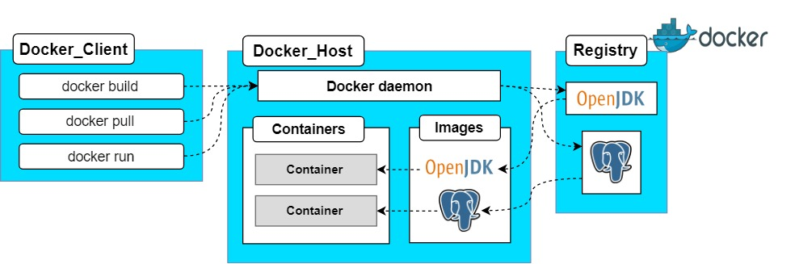
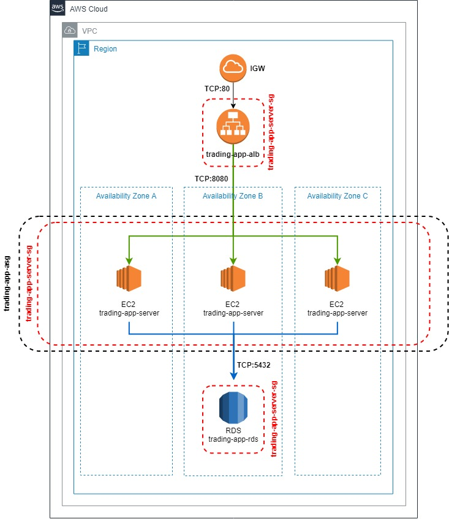
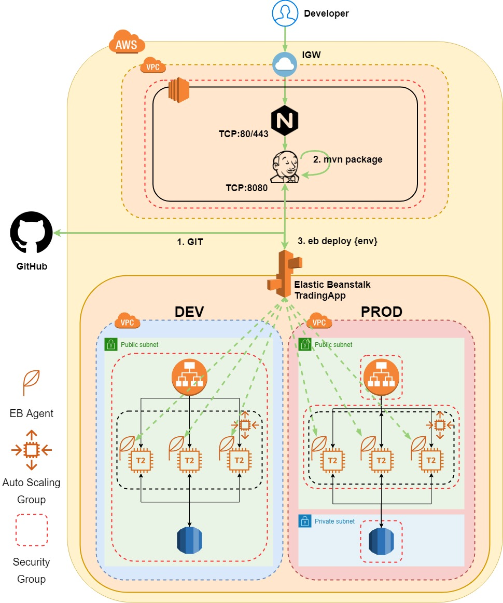

# Introduction

This project will deploy a http based stock trading REST API used to simulate the stock market and brokerage services. The application that will be deployed can be found at https://github.com/aaantunes/trading_app. 

The trading app to be deployed is a micro server written in `java` which uses `SpringBoot` to launch and configure application dependencies. `Swagger UI` is used to test all end-points. Market Data is received through http requests to `IEX Cloud`. All data is then persisted to a `PSQL` Database.

# Docker Architecture Diagram

- Two docker files
  - trading-app
  - talk about the process (e.g. compile and package jar and run the app)
  - jrvs-psql
  - talk about how to create tables (e.g. schema.sql)

# Cloud Architecture Diagram

- - 

# AWS EB and Jenkins CI/CD Pipeline Diagram

